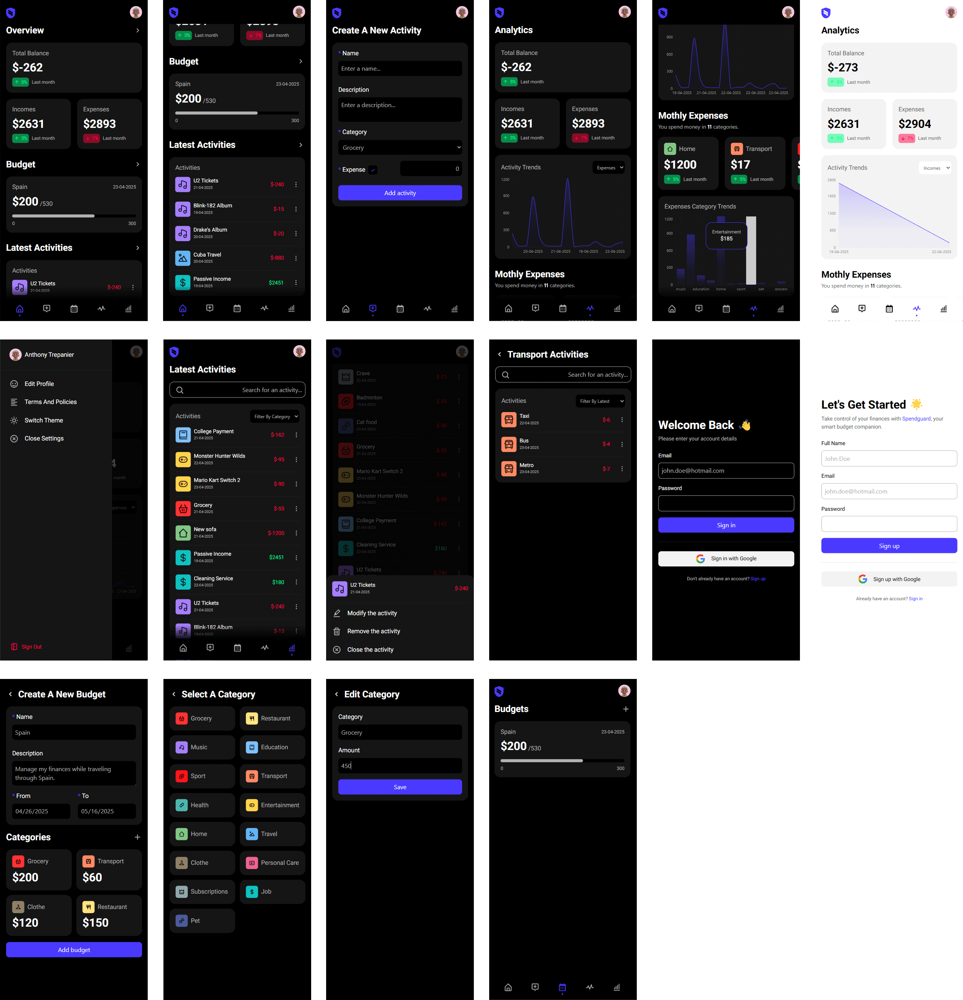

# Spendguard App

## Overview

SpendGuard is a modern, interactive budgeting application built with React that empowers users to efficiently manage their personal finances. Developed entirely by me, the app provides dynamic tools to track incomes and expenses while offering insightful analytics and visualizations on budget trends. It delivers a smooth and responsive user experience through the use of React, React Router, Supabase, and Tailwind CSS.

## Roadmap

At the time of writing, SpendGuard is still under active development.

### Upcoming features / improvements

- Add a "Create Budget" page (In Progess)
- Improve the "SignIn" / "SignUp" page visually (In Progess)
- Implement the date comparaison (To Do)
- Improve the "SignIn" / "SignUp" page visually (In Progess)
- Add an "Onboarding" page (To Do)
- Add an "Edit Profile" page (To Do)
- Enhance responsiveness for different devices (To Do)

## Known bugs

- Showcase correctly activities when an activity is deleted (In Progess)

## Getting started

To set up and run the project locally, follow these steps:

```bash
npm install
npm run dev
```

## Technologies Used

- React: Component-based UI development.

- Tailwind CSS: Provides utility-first styling for a responsive design.

- Supabase : Backend-as-a-service for authentication, database, and storage.

- React-Router : Handles client-side routing for navigating between pages seamlessly.

- Context API: A built-in state management solution for efficient global data handling.

- Redux : A predictable state container for better scalability and centralized state management.

## Features

- Expense & Income Tracking: Log and categorize financial activities with ease.

- Activity History: View and manage the latest transactions in an organized timeline.

- Analytics & Charts: Gain insights into spending patterns with dynamic visualizations.

- User Authentication: Secure login and account management using Auth0.

- Modular Components: Well-structured, reusable components for easy maintenance and scalability.

- State Management: Efficient data handling with the Context API, providing a smooth state transition across components.

## Media


